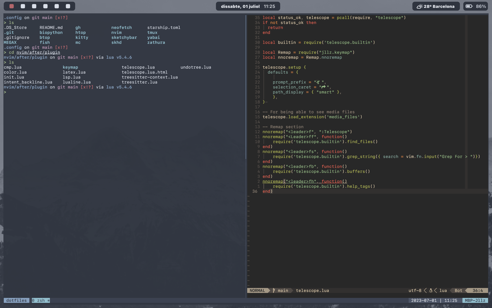

# dotfiles

Like all the cool kids, I had to rice my mac a bit. These are my configuration files for:

- Terminal emulator: [Kitty](<https://github.com/kovidgoyal/kitty>)
- Terminal multiplexer: [tmux](<https://github.com/tmux/tmux>)
- Custom prompt: [Spaceship](<https://spaceship-prompt.sh/>)
- Text editor: [Nvim](<https://github.com/neovim/neovim>)
- Tiling window manager: [Yabai](<https://github.com/koekeishiya/yabai>)
- Keyboard keybindings: [skhd](<https://github.com/koekeishiya/skhd>)
- Bar: [SketchyBar](<https://github.com/FelixKratz/SketchyBar>)
